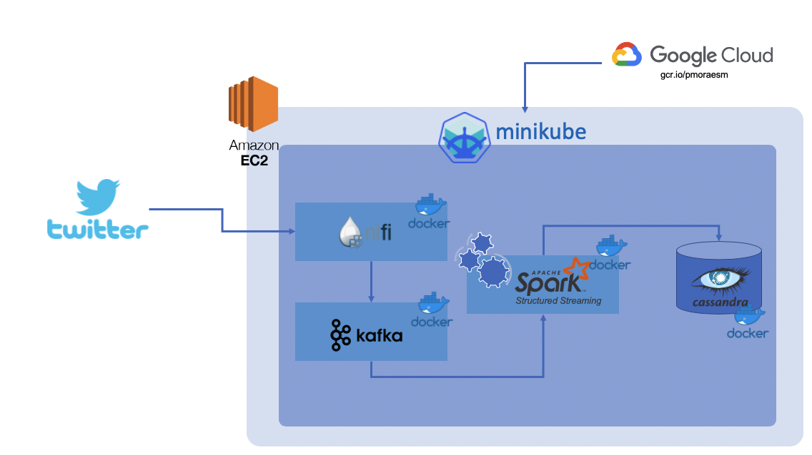

# Data Challenge1


## Use Case description
Build a streaming application that reads tweets (via Twitter API) and calculates the top hashtags used, distributed by the following aspects: 

    - Language  
    - Date  
    - Source (e.g. Twitter from Iphone)  
  

## High Level Architechture



## Environment Setup

1. Spin off an EC2 instance and deploy Minikube.

2. Deploy Apache Nifi Helm Chart.
```
helm repo add cetic https://cetic.github.io/helm-charts
helm install tweets cetic/nifi
```

3. Deploy Apache Kafka Helm Chart.
```
helm repo add bitnami https://charts.bitnami.com/bitnami
helm install tweets-kafka bitnami/kafka --set zookeeper.enabled=false,externalZookeeper.servers=tweets-zookeeper:2181
```

4. Deploy Cassandra Helm Chart.
```
helm install tweets-db --set dbUser.user=admin,dbUser.password=<password> bitnami/cassandra
```

5. Upload Nifi template via UI.

6. Insert Tweeter API tokens in processor GetTwitter.


## Run the Application

1. Start all processors in Apache Nifi.  
   Browse to:
   ```
   http://<ec2-public-ip>:8081/nifi
   ```
2. Deploy the count_hashtags container in minikube: 
   ```
   sudo kubectl run count-hashtags --image gcr.io/pmoraesm/count_hashtags:0.4
   ```
    


## Docker Images
The docker images used in this project are available at https://gcr.io/pmoraesm. Two images are available: 

    - pyspark: A pyspark interactive environment, used for testing purposes 
    - count_hashtags : The spark application that processes counts the hashtags and saves it to the database, starts processing and saving results to Cassandra automatically. 
